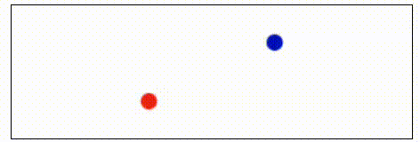

# React + TypeScript + Vite Example

This example project demonstrates how to use peak-threads with Vite, React, and TypeScript.

## Code Overview

The project is setup to create a global thread pool, and then to use React Contexts to make that pool accessible wherever
background work is needed. The pool context is defined in `src/poolContext.ts` and the initialization is done in `src/ThreadPoo.tsx`.

The worker code is all stored in `src/worker.ts` and included with the line `import WorkerUrl from "./worker.ts?worker&url";`.
This line tells Vite to compile `worker.ts` as a separate entrypoint for a Worker, and then it tells Vite to give us the URL
for that file. The reason we ask for the URL is so we can then pass it on to our thread pool with `Pool.spawn(WorkerUrl, {type: 'module'})`.
Once the pool is created, we then set it in our context state and finish setting up the rest of our application code.
At that point, our pool can be used from anywhere in our app!

Usage of the pool is done from `src/Montecarlo.tsx` (by far the simplest) and `ImageManipulation.tsx` - which does a lot
of stuff for loading (while giving time to the UI loop when possible), reading inputs, transferring, receiving, and rendering.
There is a lot more going on there.

In both cases, the actual work is in a separate file so I can use the code in both the UI and worker threads.
The Montecarlo code is the simplest, and is at `src/montecarlo.ts`. The image manipulation code is at `src/ImageManipulation.ts`
and has code for downscaling, applying kernels, and pixelating. The code is not super-optimized, but it is trying to be
aware of slow patterns that often happen in JavaScript and avoid them (e.g. extensive heap allocations through closures
and objects per pixel or creating lots of indirection, rather than using local numbers that can be on the stack and accessing
the bytes directly). The goal is to simulate a "reasonably fast" library that you might find developed internally that sits
somewhere between faster than the random blog post/StackOverflow/AI generated answer you found vs a highly tuned NPM package.
Given that it sits in that middle, it's probably faster than most NPM packages, but slower than the top tier.
Either way, it's good enough for this demo.

The rest of the code is mostly dressing and visualizations. I tried to use as few abstractions as possible, so some of the code is a little more verbose
that what you might see in a production app (e.g. I didn't use DRY so there's a lot of repeated HTML elements rather than
a data-driven approach). But that's mostly since I wanted this to be a read focused around clarity and seeing how to use
something, rather than a showcase of how clever an abstraction is. Plus, it's not really that much extra code.

## App Overview

For this application, we have a few different elements going on to help highlight what is happening.
The first is a JS-driven animation that updates every microtick. The purpose of this animation is to help highlight
any stutters that happen on the main thread, and to make those stutters feel more impactful.

The second element is the Montecarlo simulation. When the button is clicked, it will run a Montecarlo simulation
of rolling hundreds of dice to exceed a threshold. It takes a bit. The demonstration here highlights the "best-case"
scenario for relieving stutter from the main thread. The simulation sends one number, does a lot of calulcations,
and receives one number. It is almost entirely compute-bound.

The third element is the image upload and filter. This is an example of Web APIs still making some things slow,
and how even with memory transferring we often need to resort to other mechanisms to keep the UI moving - especially
for memory-bound tasks.

The issue with the Web APIs is that to get image data from a thread, you need to draw to a canvas, and then read from that canvas.
The read creates a copy, and happens in the main thread. Which is slow. But, we cannot send the data over to the background
thread until we have finished reading. So, what do we do? We read line-by-line and insert micro pauses into our loop.
This happens in both the threaded and non-threaded versions of our code. This helps keep the comparison consistent
and focused on how much actually gets saved (the procesing time) rather than convoluting it with what can't be helped
(the Web API/loading time).

This demo is set-up so that once you load an image, you can run multiple operations on that image. Each operation
will trigger a rescaling of the original image and processing of the rescaled image (though you could edit the code
and see what happens the other-way around). The "Blur" operation is by far the slowest and will cause the most stutter.
The other operations are all fairly quick. I have it setup to downscale images and then process since most of the apps
I have worked on would then send those images to the server, and downscaled images are just way cheaper to send over the
network (and takes a lot less server CPU). Also, it makes the effect more uniform regardless of the image size.

Note that for image downscaling, I'm not using Web APIs. I only use Web APIs to upload and load a file. I'm manually
downscaling the image in JavaScript directly as that lets me offload that work to a background thread. That also means
you can upload some really massive images and see how much performance improvement you'd get by downscaling them in the
main thread or in a background thread!

The goal of the image use case is to demonstrate a more typical/average/nuanced view where it's not always super noticeable.
For small images (only a few MB) it's going to be barely noticeable. For larger images though, it can make quite a difference.

Also, this example shows how to use the transfer feature of the Web API.

The final piece of the puzzle is the "Use Threads?" control. When checked, the montecarlo simulation and image downscaling/processing
will be moved to a thread pool. You can even run both at the same time! When not checked, montecarlo and image processing
will both happen in the main thread. By default, this is not checked so you can experience the single threaded state initially,
and then feel the threaded state.

